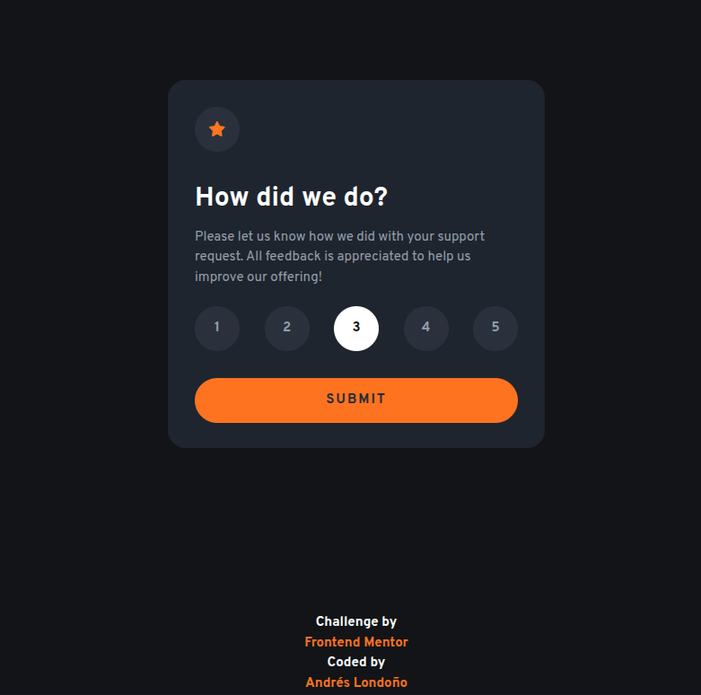
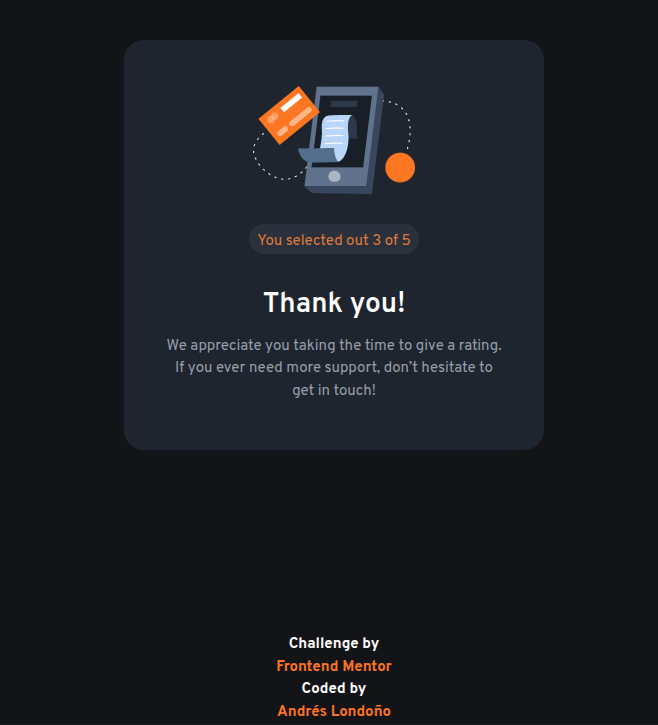
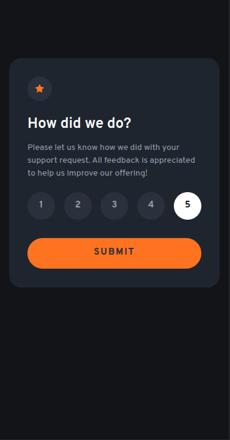
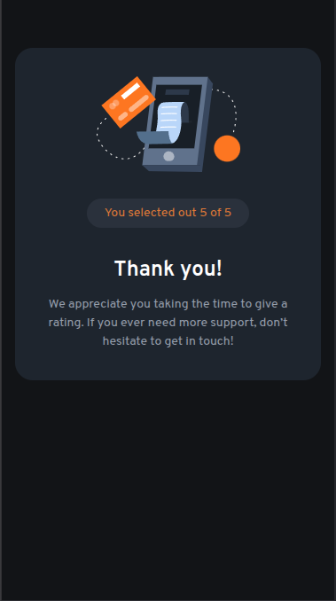

# Frontend Mentor - Interactive rating component solution

This is a solution to the [Interactive rating component challenge on Frontend Mentor](https://www.frontendmentor.io/challenges/interactive-rating-component-koxpeBUmI). Frontend Mentor challenges help you improve your coding skills by building realistic projects. 

## Table of contents

- [Frontend Mentor - Interactive rating component solution](#frontend-mentor---interactive-rating-component-solution)
  - [Table of contents](#table-of-contents)
    - [Screenshot](#screenshot)
  - [Desktop](#desktop)
  - [Mobile](#mobile)
    - [Links](#links)
  - [My process](#my-process)
    - [Built with](#built-with)
    - [What I learned](#what-i-learned)
    - [Useful resources](#useful-resources)
  - [Author](#author)


### Screenshot

## Desktop



## Mobile





### Links

- Solution URL: [Github](https://github.com/andreslondono00/interactive-rating-component)

## My process

### Built with

- Semantic HTML5 markup
- CSS custom properties
- Flexbox
- CSS Grid
- JavaScript

### What I learned

- I add an “alt” to indicate the name of the image added to the container.

```html
 <div class="icon_star"></div>
```
- I add a radiogroup role to indicate that they are groups of radio buttons and aria-checked: true or false to indicate the selection status of the button.

```html
  <div role="radiogroup" id="rate_list_button" class="rate_list_button">
    <button role="radio" aria-checked="false" class="rate_button">1</button>
    <button role="radio" aria-checked="false" class="rate_button">2</button>
    <button role="radio" aria-checked="true" class="rate_button active">3</button>
    <button role="radio" aria-checked="false" class="rate_button">4</button>
    <button role="radio" aria-checked="false" class="rate_button">5</button>
  </div>
```
- In these code snippets, I added the aria-label to give the element a name so that it can be read on screen.

```html
 <button id="submit" class="submit" aria-label="Submit Rating" onclick="onSubmitClick()">SUBMIT</button>

<div class="attribution">
  Challenge by <a aria-label="Interactive Rating Component"
    href="https://www.frontendmentor.io/challenges/interactive-rating-component-koxpeBUmI"
    target="_blank">Frontend Mentor</a>
  Coded by <a aria-label="Github" href="https://github.com/andreslondono00/interactive-rating-component">Andrés
    Londoño</a>
</div>
```
### Useful resources

- [ARIA states and properties (attributes)](https://developer.mozilla.org/en-US/docs/Web/Accessibility/ARIA/Reference) - This page explained very well how to use ARIA, its attributes, and its roles according to the accessibility you want to use.

## Author

- Frontend Mentor - [@andreslondono00](https://www.frontendmentor.io/profile/andreslondono00)

